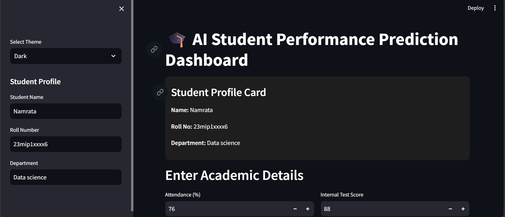
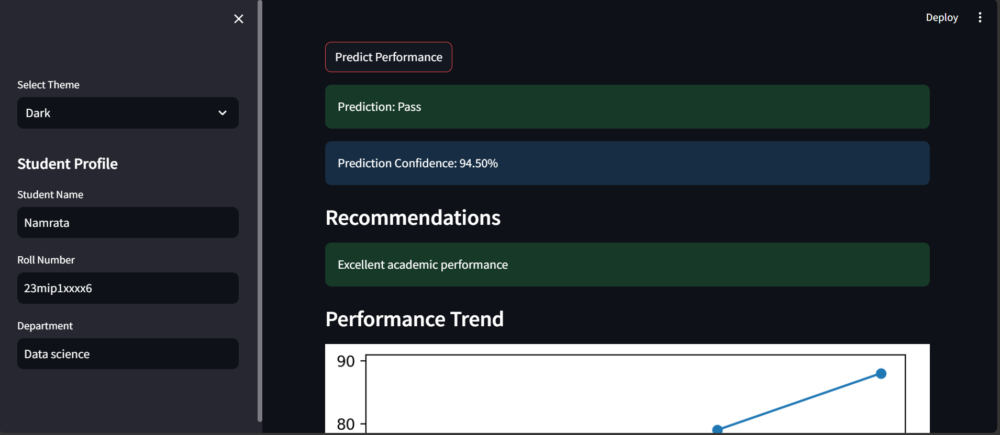

# 🎓 Student Performance Prediction System


An AI-powered student analytics dashboard that predicts academic performance using machine learning and provides personalized recommendations, visual analytics, and downloadable PDF reports.

---

## 🚀 Features

✅ Student Performance Prediction using Machine Learning
✅ Prediction Confidence Percentage
✅ Personalized Academic Recommendations
✅ Light / Dark Theme Toggle
✅ Student Profile Card
✅ Performance Trend Visualization
✅ PDF Report Generation
✅ Interactive Dashboard using Streamlit

---

## 🛠️ Technologies Used

* Python
* Streamlit
* Scikit-learn
* Pandas
* NumPy
* Matplotlib
* ReportLab

---

## 📂 Project Structure

```bash
student-performance-project/
│── app.py
│── train_model.py
│── recommendation.py
│── model.pkl
│── student_data.csv
│── requirements.txt
│── README.md
│── .gitignore
```

---

## ⚙️ Installation

```bash
pip install -r requirements.txt
```

---

## ▶️ Run the Project

```bash
streamlit run app.py
```

---

## 📊 Machine Learning Workflow

1. Dataset preprocessing
2. Model training using classification algorithm
3. Performance prediction
4. Confidence calculation
5. Recommendation generation

---

## 📸 Screenshots

### Dashboard Home



### Prediction Output



### PDF Report


---

## 📈 Future Scope

* Multi-student record management using database
* Faculty login dashboard
* Admin analytics panel
* Cloud deployment
* Mobile responsive version
* Advanced ML models for higher accuracy
* Attendance integration from ERP systems

---

## 🎯 Use Cases

* Colleges for academic monitoring
* Teachers for early intervention
* Students for self-improvement
* Academic performance analytics

---

## 👩‍💻 Author

Namrata Singh


---

## ⭐ If you like this project

Star this repository and connect it with future ML projects.
